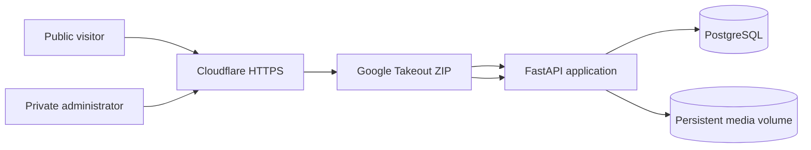

# NewsWebsite Docker

A production-oriented, self-hosted news application for `news.ieltstask.com`. It preserves the recognizable visual language and navigation of `www.ieltstask.com`, while serving an independent public application and content database from Docker.

## What It Does

- Public news homepage, article pages, Blogger pages, labels, search, comments, RSS, sitemap and robots file
- Private admin login with one capability: upload a Google Blogger Takeout ZIP
- Smart import of Blogger Atom posts, pages, authors, dates, labels and threaded comments
- Extracted Takeout images stored in a persistent Docker volume and rewritten into article content
- HTML sanitization, archive traversal protection, zip-bomb limits and duplicate-safe re-imports
- PostgreSQL, FastAPI and Cloudflare Tunnel running only in Docker
- Cloudflare-managed HTTPS for `news.ieltstask.com` without public origin ports
- No cloud-provider-specific service or external database dependency

## Architecture



See [docs/full-e2e-architecture.md](docs/full-e2e-architecture.md) for the complete design.

## Local Start

```bash
cp .env.example .env
```

Set unique secrets in `.env`. For local HTTP keep:

```dotenv
APP_ENV=development
APP_BASE_URL=http://localhost
```

Start and verify:

```bash
bash scripts/preflight.sh
docker compose up -d --build
bash scripts/healthcheck.sh
```

Open:

- Public site: `http://localhost`
- Private importer: `http://localhost/login`

The admin username and password come only from `.env`; they are never stored in Git or the database.

## Deploy From Repository And Branch

On any public Linux host with Git, Docker Engine and Docker Compose:

```bash
git clone --branch NewsWebsiteDocker --single-branch \
  https://github.com/psainaveen12/NewsWebsite.git \
  /opt/newswebsite
cd /opt/newswebsite
cp .env.example .env
```

Set these production values:

```dotenv
COMPOSE_PROFILES=cloudflare
APP_ENV=production
APP_BASE_URL=https://news.ieltstask.com
APP_DOMAIN=news.ieltstask.com
CLOUDFLARE_TUNNEL_TOKEN_FILE=./secrets/cloudflare-tunnel-token
```

Create a remotely managed Cloudflare Tunnel, publish `news.ieltstask.com` to `http://app:8000`, and save its token in `secrets/cloudflare-tunnel-token`.

Generate secrets instead of reusing examples:

```bash
openssl rand -hex 32
openssl rand -hex 48
```

Deploy:

```bash
bash scripts/preflight.sh
docker compose up -d --build
bash scripts/healthcheck.sh
```

Future branch updates:

```bash
cd /opt/newswebsite
DEPLOY_BRANCH=NewsWebsiteDocker bash scripts/deploy.sh
```

Or use the generic repository installer:

```bash
bash scripts/deploy-from-repo.sh \
  https://github.com/psainaveen12/NewsWebsite.git \
  NewsWebsiteDocker \
  /opt/newswebsite
```

## Cloudflare DNS And Tunnel

Add `ieltstask.com` to Cloudflare and use the Cloudflare nameservers at the domain registrar. Preserve the existing root and `www` DNS records. Creating the tunnel public hostname automatically creates the proxied `news` CNAME; no Elastic IP or inbound web ports are needed.

Full steps: [docs/deployment-and-dns.md](docs/deployment-and-dns.md).

## Google Takeout Import

1. Open [Google Takeout](https://takeout.google.com/).
2. Deselect all products and select **Blogger**.
3. Create and download the ZIP export.
4. Do not unzip or edit the archive.
5. Sign in at `/login` and upload it.
6. Follow live progress in the import audit list.

The original upload is removed after processing. Re-importing the same blog updates matching Blogger records instead of duplicating them.

## Operations

```bash
bash scripts/backup-db.sh
bash scripts/backup-media.sh
bash scripts/restore-db.sh backups/db/news-TIMESTAMP.sql.gz
bash scripts/restore-media.sh backups/media/media-TIMESTAMP.tar.gz
docker compose logs --tail=100 app cloudflared db
```

Run tests:

```bash
python -m venv .venv
.venv/bin/pip install -r requirements-dev.txt
.venv/bin/pytest
```

Never commit `.env`, database dumps, Takeout archives, extracted media, SSH keys or backups.
