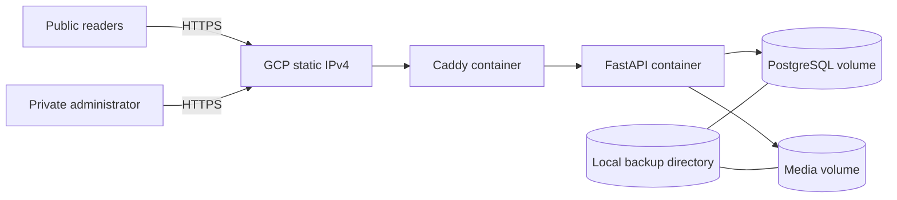

# NewsWebsite GCP

A production-oriented, self-hosted news platform for `news.ieltstask.com`. The complete runtime - Caddy, FastAPI, PostgreSQL, imported Blogger media and local backups - runs on one Google Compute Engine VM with Docker Compose. There are no AWS services, external databases, Cloudflare services or managed application runtimes.

## Product

- Public homepage, article pages, Blogger pages, labels, search, comments, RSS, sitemap, robots and read-only JSON API
- Responsive light/dark UI aligned with the navigation, typography, cards, sidebar and article presentation of `www.ieltstask.com`
- One private admin login whose only application capability is uploading a Google Blogger Takeout ZIP
- Classic and modern Takeout support for posts, pages, drafts, authors, labels, dates, descriptions, comments and media
- Sanitized HTML, archive traversal and zip-bomb protection, checksum-deduplicated assets, idempotent re-imports and audit history
- Legacy Blogger URL redirects and imported internal-link repair
- Google/Bing verification, Analytics, AdSense, structured data, IndexNow, sitemap, RSS and `ads.txt`

## Architecture



PostgreSQL and FastAPI have no public host ports. Only Caddy publishes `80` and `443`. See [the architecture](docs/full-e2e-architecture.md) and [security model](docs/security.md).

## Local Development

```bash
cp .env.example .env
# Replace the database, session and admin placeholders in .env.
bash scripts/preflight.sh
docker compose up -d --build
bash scripts/healthcheck.sh
```

Open `http://localhost` and `http://localhost/login`.

## GCP Production

The complete, ordered procedure is in [docs/deployment-and-dns.md](docs/deployment-and-dns.md). The short path is:

```bash
GCP_PROJECT_ID=YOUR_PROJECT SSH_SOURCE_CIDR=YOUR_PUBLIC_IP/32 \
  bash scripts/gcp/provision-instance.sh

# On the Ubuntu VM after cloning NewsWebsiteGCP:
SSH_SOURCE_CIDR=YOUR_PUBLIC_IP/32 bash scripts/gcp/bootstrap-ubuntu.sh
cp .env.example .env
# Configure production values and secrets in .env.
bash scripts/preflight.sh
docker compose up -d --build
bash scripts/healthcheck.sh
bash scripts/install-operations.sh
```

In Squarespace DNS, point only the `news` A record to the reserved GCP IPv4. Do not change the root or `www` records.

## Admin And Takeout

The username is configured as `sainaveennews`. Set the requested password only in the VM’s `.env` as `ADMIN_PASSWORD`; never commit it. Because that password has been shared in conversation, rotate it after first login.

1. Download a Blogger-only ZIP from [Google Takeout](https://takeout.google.com/).
2. Sign in at `https://news.ieltstask.com/login`.
3. Upload the original ZIP without extracting or modifying it.
4. Follow the import progress and review warnings.
5. Run `bash scripts/migration-audit.sh` and manually inspect the highest-traffic historic URLs.

## Operations

```bash
bash scripts/backup-all.sh
bash scripts/test-backups.sh
bash scripts/monitor.sh
bash scripts/verify-production.sh
bash scripts/migration-audit.sh
bash scripts/indexnow-submit.sh
docker compose logs --tail=100 app caddy db
```

GitHub Actions tests every push to `NewsWebsiteGCP`, then deploys over SSH. Required setup is documented in [the deployment guide](docs/deployment-and-dns.md).

## Runbook Coverage

The uploaded production runbook is mapped to this implementation in [docs/runbook-implementation.md](docs/runbook-implementation.md). WordPress, MariaDB, Site Kit and WordPress write APIs are intentionally replaced by the existing FastAPI/PostgreSQL Takeout-only CMS because the requested administrator must not receive editing, plugin, user-management or publishing capabilities.
