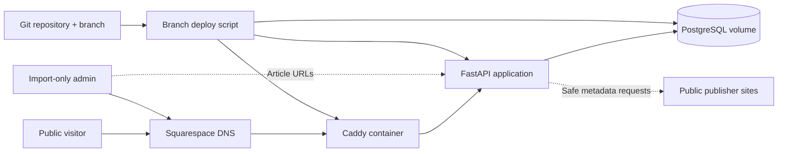
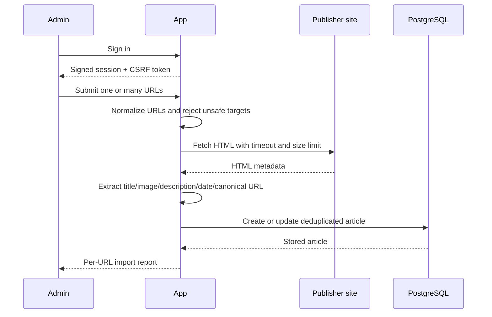
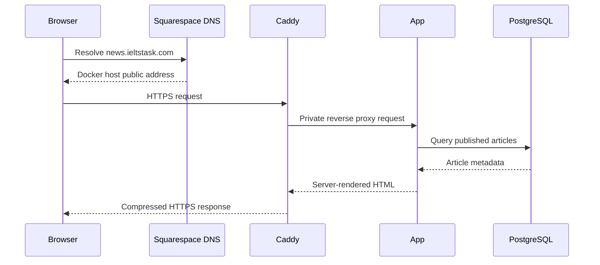
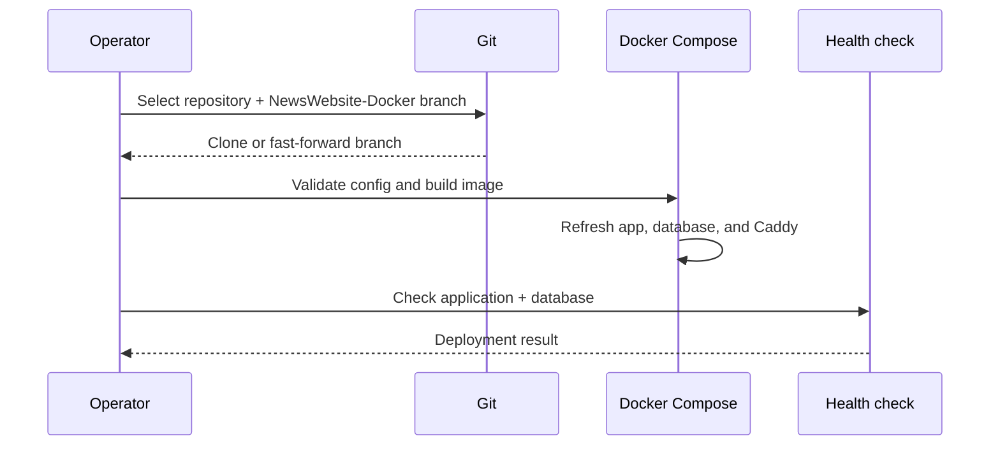

# Full End-to-End Architecture

## Scope

IELTSTask Newsroom is a provider-neutral Docker application. It ingests public article metadata through a restricted admin workflow and publishes stored article summaries at `news.ieltstask.com`.

No cloud-provider database, object store, queue, authentication service, or deployment service is required.

## Topology

## Runtime Services

### Caddy

- Publishes host ports `80`, `443/tcp`, and `443/udp`
- Obtains and renews the TLS certificate for `news.ieltstask.com`
- Adds transport and browser security headers
- Prevents caching of login and admin responses
- Proxies application requests over the private frontend network

### FastAPI application

- Renders the public newsroom and article summary pages
- Implements the admin login and import-only authorization boundary
- Enforces signed, secure, same-site session cookies and CSRF tokens
- Fetches metadata with redirect validation, DNS/IP filtering, byte limits, and timeouts
- Deduplicates by source and canonical URL
- Exposes `/healthz` for container and deployment checks
- Runs as a non-root user with a read-only container filesystem

### PostgreSQL

- Stores article metadata and timestamps
- Uses a persistent named Docker volume
- Has no published host port
- Is reachable only through the internal backend network

## Article Ingestion Sequence

## Public Request Sequence

## Data Model

Each article stores:

- Original source URL and canonical URL
- Stable local slug
- Title and publisher-provided description
- Publisher image URL
- Author, publisher name, and source domain
- Original publication time
- Fetch, creation, and update times
- Publication state and minimal raw metadata

The application does not copy full article bodies. Public pages display the stored summary and link to the original publisher.

## Deployment Flow

The `.env` file remains only on the deployment host. Git contains no database password, session secret, or admin password.

## Failure And Recovery

- Containers restart automatically unless deliberately stopped.
- Application and database health checks gate Caddy startup and deployment completion.
- PostgreSQL data survives container recreation in `postgres_data`.
- `scripts/backup-db.sh` creates compressed logical backups.
- `scripts/restore-db.sh` restores a selected backup with SQL errors treated as fatal.
- Caddy certificate state persists in `caddy_data`.
