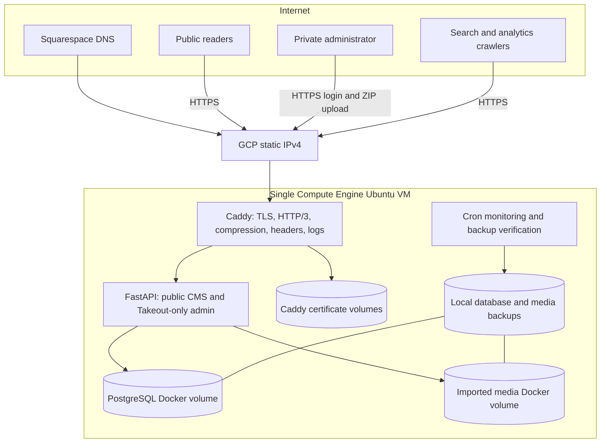

# Full End-To-End GCP Architecture

## Runtime Boundary

One GCP Compute Engine VM owns the runtime, data and operations. Its reserved static IPv4 is the target of the Squarespace `news` A record.

Only Caddy publishes host ports. PostgreSQL is on an internal Docker network and FastAPI is reachable only from Caddy and PostgreSQL’s private networks. No AWS, Cloudflare, external database, GKE, Cloud Run, load balancer or object storage service is required.

## Takeout Data Flow

1. The single administrator authenticates with server-side environment credentials.
2. Signed cookies, throttling and CSRF validation protect login, upload and logout.
3. The ZIP streams to persistent storage with byte, file-count, expanded-size, path and compression-ratio limits.
4. Assets are hashed, deduplicated and stored under the media volume.
5. Classic and modern Blogger Atom entries are classified as posts, pages or comments; valid HTML exports provide fallback content.
6. Unsafe HTML and embeds are removed; images are lazy-loaded and local Takeout references are rewritten.
7. Posts/pages are upserted by Blogger source ID, comments are linked and updated, and assets are associated with articles.
8. Historic internal links are rewritten and original Blogger paths remain available as permanent redirects.
9. The import audit records counts, progress, warnings and errors; the uploaded ZIP is deleted in all outcomes.
10. A successful import optionally submits published URLs to IndexNow.

## Public And Private Surfaces

Public: `/`, `/article/{slug}`, `/p/{slug}`, `/label/{label}`, `/search`, Blogger legacy paths, `/api/v1/articles`, `/feed.xml`, `/sitemap.xml`, `/robots.txt`, `/ads.txt`, IndexNow key and `/media`.

Private: `/login`, `/admin`, `/admin/imports` and import status polling. There is no registration, editing, deletion, plugin, theme, database, user-management or write API surface.

## Reliability

- Alembic migrations execute before app startup.
- PostgreSQL health gates FastAPI; FastAPI health gates Caddy.
- Containers restart unless stopped and logs rotate locally.
- Daily database/media backups and weekly isolated restore tests are scheduled.
- Monitoring checks containers, HTTPS/database health and disk usage every five minutes.
- Deployments back up data before a fast-forward build.
- Rollback changes application code only; Docker data volumes remain intact.
