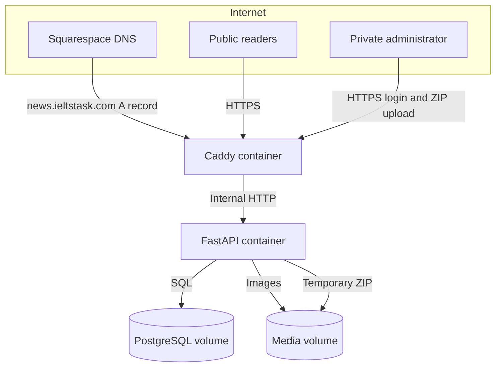

# Full End-To-End Architecture

## Runtime Boundary

The stack is provider-neutral. A Docker host with a stable public IPv4 address is the only infrastructure dependency.

Only Caddy publishes host ports. PostgreSQL is attached exclusively to the internal `backend` network. The application is not directly published.

## Takeout Data Flow

1. The administrator authenticates using credentials supplied through `.env`.
2. CSRF validation and upload-size controls run before processing.
3. The ZIP streams to the persistent import directory without loading the complete file into memory.
4. The archive index is checked for path traversal, symbolic links, file-count limits, inflated-size limits and suspicious compression ratios.
5. Image assets are hashed, deduplicated and saved under the persistent media volume.
6. Blogger Atom entries are classified as posts, pages or comments. HTML files provide a fallback for newer Takeout layouts without Atom content.
7. Post HTML is sanitized. Local image references are rewritten to `/media/...`; unsafe scripts, forms and embeds are removed.
8. Posts and pages are upserted by stable Blogger source ID. Re-importing updates matching content.
9. Comments are linked through Blogger `in-reply-to` references and upserted by source ID.
10. Import counts, warnings, errors and progress remain in PostgreSQL for auditability.
11. The original ZIP is deleted in a `finally` path after success or failure.

## Public Experience

All public routes require no session:

- `/` latest and featured stories
- `/article/{slug}` articles and imported comments
- `/p/{slug}` imported Blogger pages
- `/label/{label}` categories
- `/search?q=` full-text-like search over imported content
- `/feed.xml`, `/sitemap.xml`, `/robots.txt`
- `/media/...` imported assets

The private surface is limited to `/login`, `/admin`, `/admin/imports` and import status polling. There are no public registration, editing, deletion, database or user-management controls.

## Data Model

- `articles`: Blogger posts and pages, source IDs, sanitized content, labels, dates and display metadata
- `comments`: imported Blogger comments linked to their article
- `assets`: checksum-deduplicated media and public paths
- `import_jobs`: upload audit, state, progress, counts, warnings and failures

## Reliability

- Alembic migrations run before every application start.
- PostgreSQL and application health checks gate dependent containers.
- Restarted in-flight imports are marked failed instead of remaining permanently processing.
- Database and media have separate backup/restore procedures.
- The deployment script only fast-forwards the selected Git branch.
